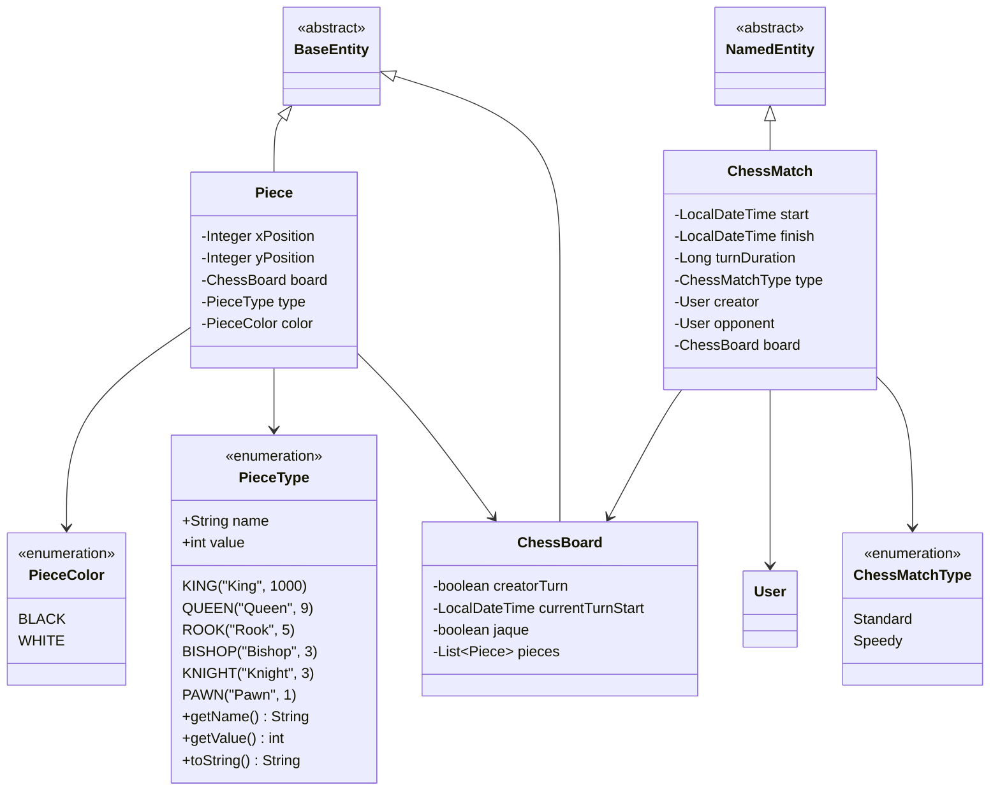

# Domain Class diagrams of our Chess Game

```mermaid
classDiagram
    class BaseEntity {
        <<abstract>>
    }

    class NamedEntity {
        <<abstract>>
    }

    class ChessBoard {
        -boolean creatorTurn
        -LocalDateTime currentTurnStart
        -boolean jaque
        -List~Piece~ pieces        
    }

    class ChessMatch {
        -LocalDateTime start
        -LocalDateTime finish
        -Long turnDuration
        -ChessMatchType type
        -User creator
        -User opponent
        -ChessBoard board
    }

    class Piece {
        -Integer xPosition
        -Integer yPosition
        -ChessBoard board
        -PieceType type
        -PieceColor color
    }

    class ChessMatchType {
        <<enumeration>>
        Standard
        Speedy
    }

    class PieceColor {
        <<enumeration>>
        BLACK
        WHITE
    }

    class PieceType {
        <<enumeration>>
        KING("King", 1000)
        QUEEN("Queen", 9)
        ROOK("Rook", 5)
        BISHOP("Bishop", 3)
        KNIGHT("Knight", 3)
        PAWN("Pawn", 1)
        +String name
        +int value
        +getName() String
        +getValue() int
        +toString() String
    }

    BaseEntity <|-- ChessBoard
    NamedEntity <|-- ChessMatch
    BaseEntity <|-- Piece

    ChessMatch --> ChessMatchType
    ChessMatch --> User
    ChessMatch --> ChessBoard
    Piece --> ChessBoard
    Piece --> PieceType
    Piece --> PieceColor
```
